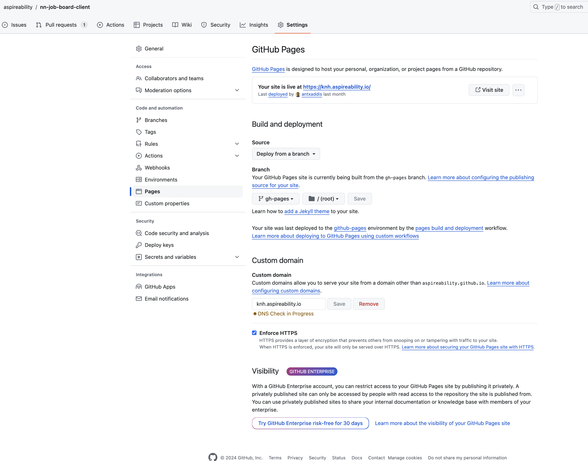

## Navajo Nation Job Board - Browser Client

This repo contains the client code for the Navajo Nation Job Board, hosted at https://knh.aspireability.io.

### Overview

The job board is build using the [React](https://react.dev/) javascript frontend library using the [typescript](https://www.typescriptlang.org/) programming language.

- All code is under `src/` folder
- Public assets like logos and banner images are under `/public`

### Getting Started

Install the following:
- Typescript
- [Yarn](https://yarnpkg.com/)

Install Libraries - first time or when there are updates in `package.json`

```
yarn
```

Copy environment files to your local repo folder
```
cp .env.example .env
```

### Running the code

```
yarn start
```

### How it works

- The client assumes the existence of a [Directus](https://directus.io/) project API. Directus is a database-as-a-service platform that allows us to store store and maintain our data, and provides an auto-generated API for each data table we manage.
- The `.env` file specifies the directus API the client is retrieving the data it needs to populate the job board pages. It is pointed to our `live` environment by default. You can also point it to a locally running directus environment.
- The `.env` file also contains the relevant google analytics id so we can properly track who is accessing the website.
- The hosted Directus instance where our live data is located at the following url: https://aspire-ability-navajo-nation-job-board.directus.app. Talk to a team member for to get access as a new user.
- We only manage one table in Directus: `Jobs`. This table contains all the jobs available for the job board. The data for this table is usually populated through a scrapping script (learn more at https://github.com/aspireability/nn-job-scrapper)

### Data Access

The job board data can be accessed through the directus exposed API, currenly setup as open to public without any authenticaion, by hitting the following endpoint

```
https://aspire-ability-navajo-nation-job-board.directus.app/items/Jobs?limit=-1
```

### Hosting and Deployment

- The client is hosted using [GitHub Pages](https://pages.github.com/) feature from GitHub. GitHub Pages allows us to host a website straight from a GitHub repository at a domain of our choosing. 
- The domain is configured in the `CNAME` file, in the settings of our domain / DNS manager (google domains), and the [settings for the repository](https://github.com/aspireability/nn-job-board-client/settings/pages).

#### Deploying updates to the live website

1. Check your `.env` file to make sure that the API url and google analytics code are set to the correct values
2. Run the deploy command
```
yarn deploy
```
3. Press 'Enter' key to continue.
4. Once you see 'Done' message, go to the repo on GitHub, and make sure the GitHub Pages 'Custom Domain' field is set to `knh.aspireability.io`. Click 'Save'. (See screenshot below)
5. Changes should be live at https://knh.aspireability.io in a few minutes.




### Transferring Maintenance of the Job Board

Please see sections above for full context. Transfer would involve providing access to the following:
- Admin credentials to the [Job Board Directus Instance](https://aspire-ability-navajo-nation-job-board.directus.app)
- Admin access to [this repository](https://github.com/aspireability/nn-job-board-client)
- Admin access to the [job scrapper repository](https://github.com/aspireability/nn-job-scrapper)
- Transfer of the `knh.aspireability.io` domain or configuration of a new domain (see Hosting section above)
